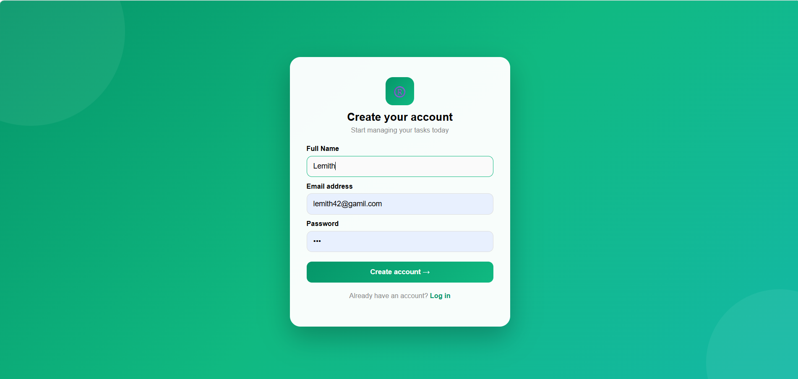
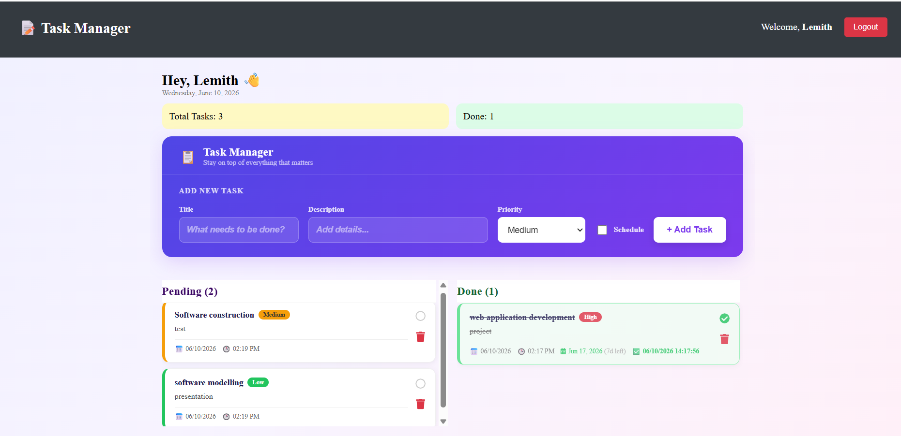

# 📋 Task Manager - Full-Stack Task Management Web Application

A modern, responsive, and secure Full-Stack Task Management web application built to help users efficiently organize, track, and prioritize their daily workflows. The application features a dual-column layout separating pending and completed tasks, along with automatic priority-based sorting.

---

## 🚀 Core Features

- 🔐 User Authentication (JWT + bcrypt)
- 🎨 Modern responsive UI with gradient design
- 📝 Full CRUD Task Management
- 📊 Priority-based sorting (High / Medium / Low)
- 📌 Dual column dashboard (Pending / Done)
- 📱 Fully responsive mobile-friendly layout

---

## 🛠️ Tech Stack

### Frontend
- React.js (Hooks + Functional Components)
- React Router DOM
- Axios
- CSS (Flexbox + Grid)

### Backend
- Node.js
- Express.js
- JWT Authentication
- CORS

### Database
- MongoDB Atlas

---

## 📸 Screenshots

### Register Page


### Login Page


### Dashboard


---

## 💻 Local Setup

### 1️⃣ Clone the repo
```bash
git https://github.com/Lemith020/Manage-Task-List.git
cd Manage-Task-List